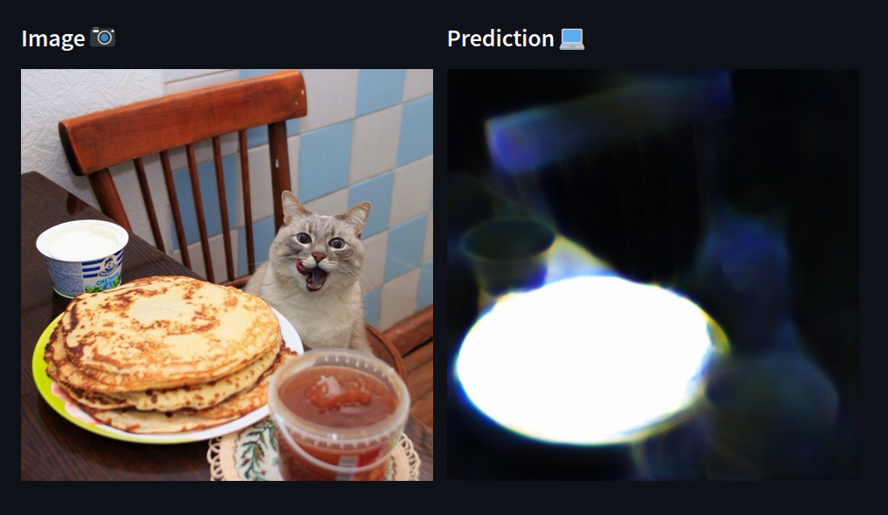

# flax-u2net

- Flax/JAX implementation of [U2-Net: Going Deeper with Nested U-Structure for Salient Object Detection](https://arxiv.org/pdf/2005.09007.pdf).
- Original implementation found [here](https://github.com/xuebinqin/U-2-Net)
- Replaced batch normalization with layer normalization.
- Using Tensorflow Dataset API For data loading.
- DUTS dataset found [here](http://saliencydetection.net/duts/#org3aad434)
- Attempt to generalize the RSU Block to avoid duplication of code for varying levels

Below is an example where the model detects the blini (a type of Russian pancake) instead of the cat.

